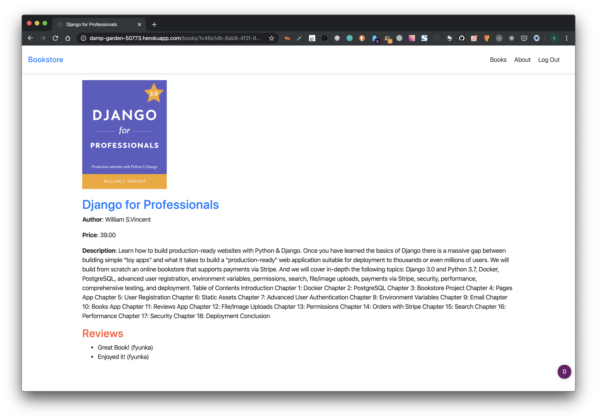

# Online Bookstore App

   

 &nbsp; 

[Online Bookstore Demo](https://damp-garden-50773.herokuapp.com/)

## Introduction

### Learn how to build production-ready websites with Python & Django.

Once you have learned the basics of Django there is a massive gap between building simple "toy apps" and what it takes to build a "production-ready" web application suitable for deployment to thousands or even millions of users.

We will build from scratch an online bookstore that supports **payments via Stripe**. And we will cover in-depth the following topics: **Django 3.0** and **Python 3.7**, **Docker**, **PostgreSQL**, advanced user registration, environment variables, permissions, search, file/image uploads, payments via Stripe, security, performance, comprehensive testing, and deployment.

## Table of Contents

* Introduction
* Chapter 1: Docker
* Chapter 2: PostgreSQL
* Chapter 3: Bookstore Project
* Chapter 4: Pages App
* Chapter 5: User Registration
* Chapter 6: Static Assets
* Chapter 7: Advanced User Authentication
* Chapter 8: Environment Variables
* Chapter 9: Email
* Chapter 10: Books App
* Chapter 11: Reviews App
* Chapter 12: File/Image Uploads
* Chapter 13: Permissions
* Chapter 14: Orders with Stripe
* Chapter 15: Search
* Chapter 16: Performance
* Chapter 17: Security
* Chapter 18: Deployment
* Conclusion

## Reference Materials 

* [Django for Professionals Book by William S. Vincent](https://djangoforprofessionals.com/introduction/)
* [Docker Desktop](https://www.docker.com/products/docker-desktop)
* [Online Payment Stripe](https://stripe.com/)
* [Email Service SendGrid](https://sendgrid.com/)
* [Heroku](https://dashboard.heroku.com)
* [Heroku Django store your uploaded media files for free](https://www.dothedev.com/blog/heroku-django-store-your-uploaded-media-files-for-free/)
* [Cloudinary Django Repo for example reference](https://github.com/mutaimwiti/cloudinary_app)
* [Django documentation](https://docs.djangoproject.com/en/3.0/)

